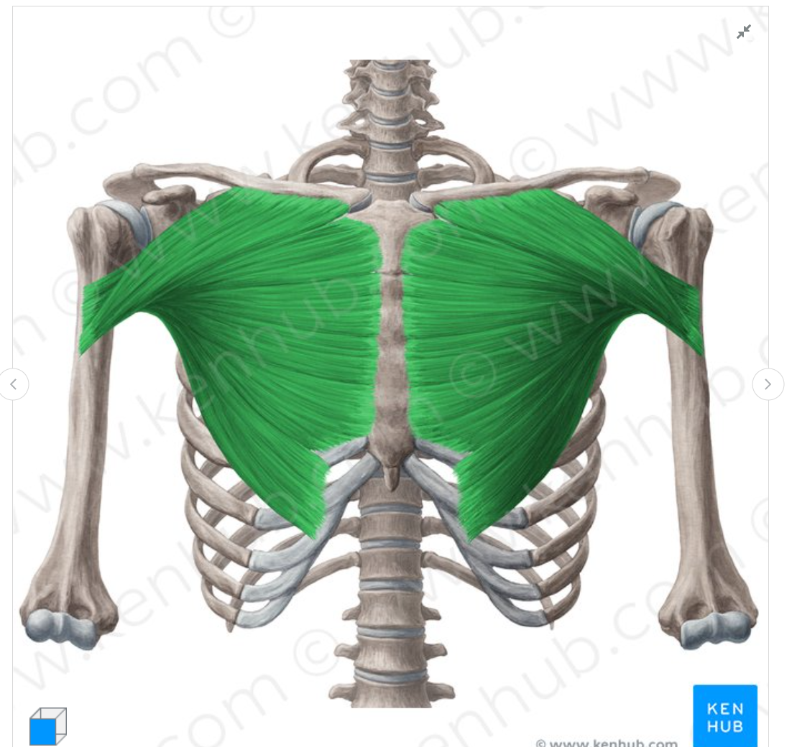
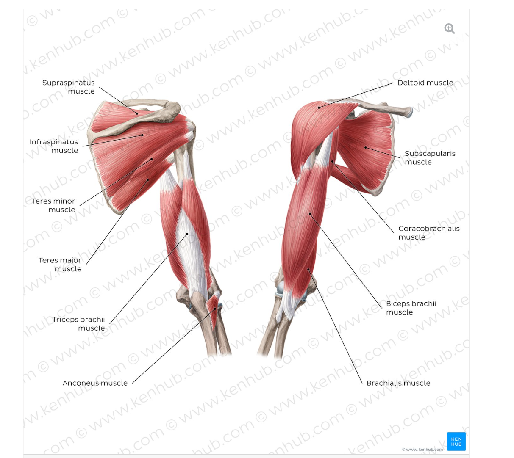
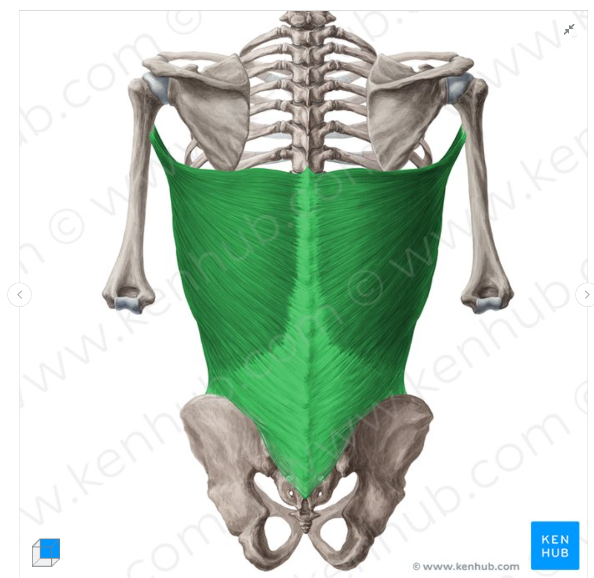

# 零基础起步？先读这个（10 分钟懂本质）
- 读完本页 -> 再看 `TRAINING_PHILOSOPHY.md`（进阶：疲劳管理、营养、行为系统）。
- 目标：用最少概念让新人先懂「身体怎么动」「训练的业务流程」。

## 仓库前言（基于 README）
这个仓库不是给你一堆动作视频，而是教你「为什么」和「怎么」自己变强。MOTIVUE 的核心是赋权：学会后，你能独立练，不用永远依赖教练。这里是最基础版，从「身体怎么动」讲起，看完再读 `TRAINING_PHILOSOPHY.md` 里的细节。

## 1. 身体模型：骨头 / 关节 / 肌肉 = 简单拉绳机，所有动作本质都是肌肉带动骨头产生，可以自己抬起手臂试一下，手臂伸直往前，再让手肘角度变成 90 度，这就是肱二头肌引导的，拉动小臂靠近大臂
- 骨头：硬杠子（如大腿骨、脊柱），负责被拉着动。
- 关节：转动点（膝、肘、肩），骨头绕它转。
- 骨骼肌：附着在骨头上的「绳子」，只能拉不能推，收缩时跨关节拉动骨头产生动作。
- 例：站起时，大腿肌肉拉大腿骨，绕膝关节向上转，这就是「跨关节收缩」。力量训练就是在这个杠杆上加阻力来强化它。
- 延伸阅读：上肢肌肉与动作综述（Kenhub）<https://www.kenhub.com/en/library/anatomy/upper-limb-muscles-and-movements>。
- 配图：帮助直观看懂跨关节收缩  
    
    
  
- 功能提示（中文说明）：  
  - 胸大肌：肱骨内收与内旋（adduction & medial rotation of the humerus）。  
  - 背阔肌：止点拉向起点时完成肱骨内收、伸展、内旋；起点拉向止点时可带动躯干旋转。  
  - 上臂（Arm / Brachium）：肩关节是胸/背力量跨关节作用的主要输出位点。  
  肩胛骨（起点骨头）  
   ↑  
   肌腱（近端肌腱，比较短）  
   ↑  
肱二头肌（肌肉肚子，鼓起来的部分）  
   ↓  
   肌腱（远端肌腱，又细又硬）  
   ↓  
桡骨（前臂的骨头，终点骨头）

## 2. 力量训练的核心业务流程（4 步循环）
1) 肌肉收缩，拉动骨头跨关节（如深蹲拉大腿骨向上）。  
2) 在动作路径上加阻力（杠铃/哑铃/自重），让这一步「吃力但可控」。阻力越大，挑战越大。  
3) 身体全力应对挑战，感知到「这很难」 -> 触发适应。  
4) 休息 + 适应：间歇几分钟并在训练间隔内恢复，一次训练课中累计足够的量，久而久之肌肉变粗、神经更会用力，下次同样阻力更轻松。就需要增加重量，重复循环 = 变强。  
- 所有训练都是在重复这个流程，所以很简单，只需要知道每个肌肉的功能，或者直观点，怎么样收缩，哪里在动，往哪个方向动，就能应付所有肌肉的训练。

## 3. 能量从哪来？肌肉的「短期电池」在训练或者日常中任何行动都会消耗能量
- 肌糖原 = 肌肉里的短期电池，存碳水，为高强度收缩供电。
- 一组深蹲（5-15 次）耗掉部分电量，大约 10-20 秒全力。
- 休息 1-5 分钟可充回一部分（血糖/食物补给，吃点碳水有帮助）。一般休息时间 3-4 分钟组间休息，确保心肺和肌肉恢复。
- 例：像手机电量，练一组掉 20%，歇一会儿再练能恢复一点；别把电池彻底耗干，否则恢复慢、动作质量下滑。
- 如果休息不够，一次把力量用完，一次训练的总容量（重量 × 次数）就会少很多，得到的锻炼就少，很直观。
- 没吃饭活动久了，就会低血糖，因为一直在供能，没有补充，所以练后需要及时补充碳水。
